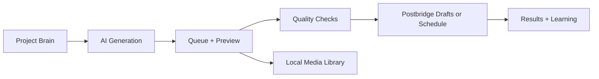

<div align="center">

# Postfarm

**A local-first content automation workspace for generating, organizing, previewing, and scheduling social posts.**

[](https://github.com/athcagithub/SlideSmith/blob/main/LICENSE)
[](#requirements)
[](https://react.dev/)
[](https://vite.dev/)
[](#local-first-privacy)
[](#local-first-privacy)

[Features](#features) • [Quick Start](#quick-start) • [Privacy](#local-first-privacy) • [Credits](#credits) • [License](#license)

</div>

---

## Attribution

Postfarm is an upgraded and expanded version inspired by the original [SlideSmith](https://github.com/athcagithub/SlideSmith) project by [athcagithub](https://github.com/athcagithub). Full credit to the original project and its creator.

This public Postfarm version is maintained by [Jet](https://github.com/setjet).

## Overview

Postfarm brings content planning, AI-assisted generation, media organization, queue review, scheduling, and learning insights into one self-run workspace.

It is built for creators, teams, and brands who want useful automation without handing their whole content system to a hosted database. Your workspace starts empty, your API keys are yours, and your local files stay on your machine unless you intentionally use a connected service.

> Postfarm is bring-your-own-keys, local-first, and designed to feel like a calm production desk instead of a SaaS dashboard you do not control.

## Postfarm vs. SlideSmith

<div align="center">

|  | [SlideSmith](https://github.com/athcagithub/SlideSmith) | Postfarm |
| --- | --- | --- |
| **Focus** | AI carousel generation and scheduling foundation | Full local-first content operations workspace |
| **Interface** | Simple creator dashboard | Polished multi-view studio with Queue, Library, Planner, Schedule, Results, Learning, Brain, and Settings |
| **Projects** | Single-workflow brand setup | Multi-project brand memory with separate defaults, accounts, style memory, and hashtag strategy |
| **Generation** | Carousel-focused AI workflow | Standard carousels, image posts, video posts, text-note templates, rewrites, scoring, topic notes, and quality guidance |
| **Planning** | Manual generation flow | Autopilot planner with date ranges, posting windows, formats, approval states, and slot-level actions |
| **Media** | Bundled image-pack approach | Local media library with folders, imports, image/video assets, empty safe public defaults, and optional Apify research |
| **Publishing** | Postbridge scheduling path | Drafts, scheduled posts, connected account loading, cached reads, rescheduling, delete flows, and conflict checks |
| **Insights** | Basic results surface | Results plus local Learning Memory built from connected analytics |
| **Privacy** | Local-first roots | Hardened open-source release: OS data directory, ignored local stores, no bundled private media, no telemetry |

</div>

<table>
  <tr>
    <td width="33%" align="center">
      <strong>Sharper Workflow</strong><br />
      Queue review, previews, planner slots, scheduling checks, and quality states make Postfarm feel like a complete production desk.
    </td>
    <td width="33%" align="center">
      <strong>Better Daily UX</strong><br />
      The UI has been expanded into a cleaner, more polished workspace for repeated creator and brand workflows.
    </td>
    <td width="33%" align="center">
      <strong>Safer Public Release</strong><br />
      Local data, API keys, media, generated posts, analytics, and schedules are kept out of Git by default.
    </td>
  </tr>
</table>

> SlideSmith is the foundation. Postfarm is the expanded, cleaner, more capable studio built on top of it.

## What You Can Do

| Workflow | What Postfarm helps with |
| --- | --- |
| Generate | Draft post ideas, captions, carousels, image posts, video posts, and optional text-note style templates. |
| Organize | Keep work in a queue, separate projects by brand, and manage media in local folders. |
| Preview | Inspect slides, captions, hashtags, quality warnings, platform fit, and scheduling context before posting. |
| Plan | Build content calendars with the autopilot planner, custom topics, posting windows, and approval rules. |
| Schedule | Create drafts or scheduled posts through Postbridge when you connect your own key. |
| Learn | Pull connected analytics into local learning memory when Postbridge is configured. |

## Features

| Category | Highlights |
| --- | --- |
| AI generation | OpenRouter and DeepSeek support, project memory, topic notes, rewrites, scoring, and style guidance. |
| Brand workspace | Multi-project setup with niche, audience, app or brand context, style memory, and hashtag strategy. |
| Content operations | Queue, preview modal, quality checks, planner slots, scheduling conflicts, and approval states. |
| Media library | Local image and video library, folders, imports, optional Apify scraping, and safe generated media handling. |
| Publishing | Postbridge account loading, media uploads, drafts, scheduling, and analytics sync when configured. |
| Privacy | Local data directory, empty first-run keys, ignored local stores, no telemetry, and no hosted Postfarm database. |

## Local-First Privacy

Postfarm stores runtime data outside this repository by default:

- Projects and project memory.
- API keys and provider settings.
- Generated queue drafts and content plans.
- Imported images, imported videos, folders, and local media indexes.
- Trend cache, analytics cache, and learning memory.

Postfarm does **not** include telemetry, product analytics, automatic cloud sync, a remote database, or background uploads.

Data only leaves your device when you use a feature that requires one of your configured external services:

| Service | Used for |
| --- | --- |
| OpenRouter | AI generation, scoring, rewrites, trends, and learning prompts. |
| DeepSeek | Alternate AI generation provider. |
| Apify | Optional research, image scraping, and video scraping workflows. |
| Postbridge | Connected accounts, uploads, drafts, scheduling, and analytics sync. |

## Quick Start

```bash
git clone https://github.com/setjet/postfarm.git
cd postfarm
npm install
cp .env.example .env
npm run dev
```

Open the local Vite URL printed in your terminal, usually:

```text
http://localhost:5173
```

The local API runs on:

```text
http://localhost:8787
```

## Requirements

- Node.js compatible with the Vite toolchain in this repo: `^20.19.0 || >=22.12.0`.
- npm.
- Optional: FFmpeg and FFprobe for video rendering workflows.
- Optional API keys for OpenRouter, DeepSeek, Apify, and Postbridge.

## Commands

| Command | Purpose |
| --- | --- |
| `npm run dev` | Start the Vite web app and local API together. |
| `npm run server` | Start the local API only. |
| `npm run build` | Run TypeScript build and Vite production build. |
| `npm run preview` | Preview the built web app. |
| `npm run lint` | Run ESLint. |
| `npm test` | Run the Node test suite. |
| `npm start` | Serve the built app and API from one Node process. |

## Environment Variables

You can configure keys in the Settings page or through local environment variables. Use placeholders only in shared examples:

```bash
OPENROUTER_API_KEY=your_openrouter_key_here
DEEPSEEK_API_KEY=your_deepseek_key_here
APIFY_API_KEY=your_apify_key_here
POSTBRIDGE_API_KEY=your_postbridge_key_here
```

Optional local overrides:

```bash
POSTFARM_DIR=/path/to/postfarm-data
POSTFARM_FONT=/path/to/bold-font.ttf
FFMPEG_PATH=/path/to/ffmpeg
FFPROBE_PATH=/path/to/ffprobe
```

## Data Storage

Postfarm creates its local workspace outside the Git checkout:

| OS | Default location |
| --- | --- |
| macOS | `~/Library/Application Support/Postfarm` |
| Windows | `%APPDATA%/Postfarm` |
| Linux | `~/.config/postfarm` |

To reset local data, stop the app and remove the Postfarm data directory for your operating system. This clears local projects, API keys, queue drafts, plans, media, caches, and learning memory. It does not delete anything from external services such as Postbridge.

## Git Safety

The repository is configured to ignore private local runtime files. Do not commit:

- `.env` files.
- Local JSON stores such as `config.json`, `queue.json`, `plans.json`, `trends.json`, `results.json`, `learning.json`, `library.json`, `folders.json`, or `videos.json`.
- SQLite or database files.
- Imported, scraped, downloaded, or generated media.
- Exports, thumbnails, caches, logs, screenshots, analytics snapshots, or scheduled-content data.

If you add demo content, keep it fake, minimal, and clearly marked.

## Project Shape



## Credits

| Project | Credit |
| --- | --- |
| Original foundation | [SlideSmith](https://github.com/athcagithub/SlideSmith) by [athcagithub](https://github.com/athcagithub) |
| Upgraded version | Postfarm by [Jet](https://github.com/setjet) |

Thank you to the original SlideSmith author for the foundation this project builds on.

## License

See [LICENSE](LICENSE). Postfarm follows the original SlideSmith license terms.

The original SlideSmith repository uses the [PolyForm Noncommercial License 1.0.0](https://github.com/athcagithub/SlideSmith/blob/main/LICENSE). Review the upstream license terms before commercial use, redistribution, or relicensing.

Required notice from the original project: Copyright 2026 Slidesmith.

## Contributing

1. Fork the repo.
2. Create a focused branch.
3. Keep local data, media, API keys, generated posts, analytics, and schedules out of commits.
4. Run `npm run lint`, `npm test`, and `npm run build`.
5. Submit a pull request with a clear summary.

## Disclaimer

Users are responsible for complying with platform rules, copyright law, and the terms of any services they connect. Imported, scraped, or generated media should be used responsibly. API providers may have their own pricing, rate limits, data policies, and usage terms.
